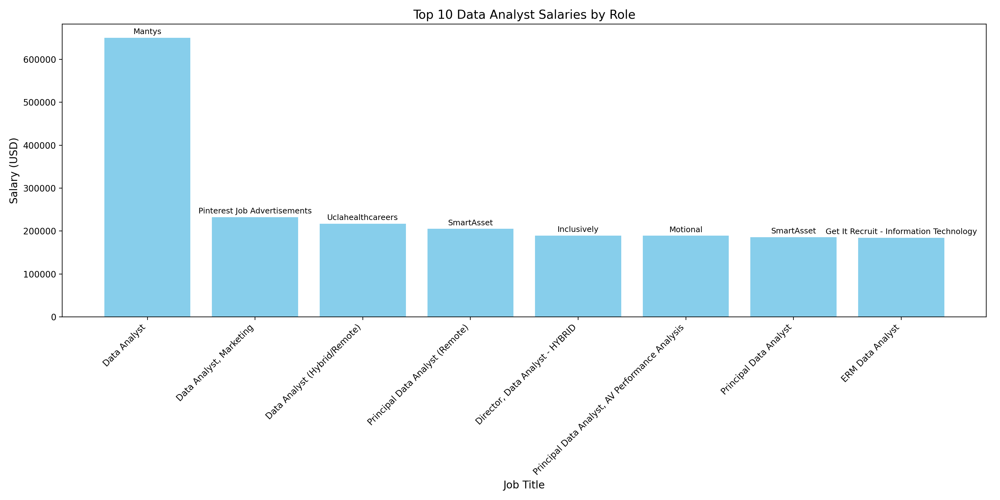
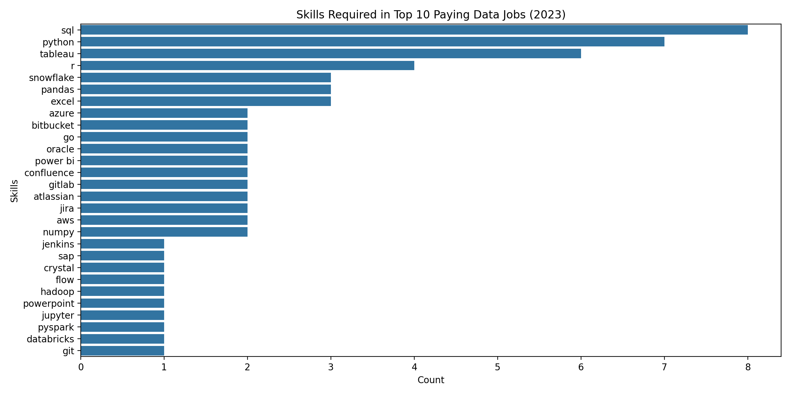

# Introduction 
📊 Dive into the data job focusing on data analyst roles, this project explores top -paying jobs. 🔥 in-demand skills, and 📈
Where high demand meets high salary in data analytics.

🔍 sql queries? Check them out here :[project_sql folder](/project_sql/)

# Background
Driven by an ambition to navigate the data analyst job market more effectively, this project was born from a desire to specify  top-paid jobs and in-demand skills, streaming others work to find optimal jobs.

Data hails from [SQL Course]{http://lukebarousse.com/sql}.it is packed with insights on job titles, salaries, locations,and essential skills.
### The question i wanted to answer through my SQL queries were:
1. What are the top-paying data analyst jobs?
2. What skills are required for these top-paying jobs?
3. What skills are most in demand for data analysts? 
4. Which skills are associated with higher salaries?
5. What are the most optimal skills to learn?

# Tools I used 
For my deep dive into the data analyst job market, I utilized the power of several key tools:

- **SQL**:The backbone of my analysis , allowing me to query the database and uncover critical insights.
- **Postgresql**: The chosen database management system, ideal for handling line job posting date.
- **Visual Studio Code**: My go-to for database management and executing SQL queries.
- **Git & Github**: Vital for version control and sharing my SQL Scripts and analysis, ensuring collaboration and project tracking.

## The Analysis
Each query for this project aimed at investigating specific aspects of the data analyst job market, Here's how i approached each question:
### 1. Top paying Data Analyst Jobs
Data Analyst positions by average yearly salary and location, focusing on remote jobs. This query highlights the high paying opportunities in the field.
```sql
SELECT
     job_id,
     job_title,
     job_location,
     job_schedule_type,
     salary_year_avg,
     job_posted_date,
     name AS company_name
FROM
    job_postings_fact
LEFT JOIN company_dim ON job_postings_fact.company_id = company_dim.company_id
WHERE
     job_title_short = 'Data Analyst' AND
     job_location = 'Anywhere' AND 
     salary_year_avg IS NOT NULL
     ORDER BY
     salary_year_avg DESC
     LIMIT 10 ;
```
Here's the breakdown of the top paying jobs in 2023:
- **Wide Salary Range**: Top 10 paying data analyst roles span from $184,000 to 650,000 indicating signififcant salary potential in the field.
- **Diverse Employers**: Companies like smartAsset, Meta, and AT&T are among those offering high salaries, showing vast interest in different industries.
- **Job Title Variety**: There's a high diversity in job titles, from Data Analyst to Director of Analytics, reflecting varied roles and specifications within data analytics.


*Bar graph visualizing the salary for the top 10 salaries for data analysts; julius Ai generated this graph from my SQL query results*

### 2.Skills for Top paying jobs
 To understand waht skills are required for the top-paying jobs, i joined the job postingd with the skills data, providing insights into what employers value for high-compensation roles.

``` sql
 WITH top_paying_jobs AS (
SELECT
     job_id,
     job_title,
     job_location,
     job_schedule_type,
     salary_year_avg,
     job_posted_date,
     name AS company_name
FROM
    job_postings_fact
LEFT JOIN company_dim ON job_postings_fact.company_id = company_dim.company_id
WHERE
     job_title_short = 'Data Analyst' AND
     job_location = 'Anywhere' AND 
     salary_year_avg IS NOT NULL
     ORDER BY
     salary_year_avg DESC
     LIMIT 10
)

SELECT 
     top_paying_jobs.*,
     skills
FROM top_paying_jobs
INNER JOIN skills_job_dim ON top_paying_jobs.job_id = skills_job_dim.job_id
INNER JOIN skills_dim ON skills_job_dim.skill_id = skills_dim.skill_id
ORDER BY
salary_year_avg DESC
```
Here's the breakdown of the most demanded skills for the top 10 highest paying data analyst jobs in 2023:

- **SQL** is leading with a bold count of 8.
- **Python** follows bold with count of 7.
- **Tableau** is also highly sought after. with a bold of 6. Other skills like R, Snowflakes, pandas and excel show varying degrees of demand.


*Bar graph visualizing the count of the top 10 paying jobs for data analysts; julius Ai generated this graph from my SQL query results*

### 3.In-Demand Skills for Data Analysts
 This query helped identity the skills most frequently in job postings, directly focused to areas with high demand.
 ```sql
  SELECT 
    Skills, 
    COUNT(skills_job_dim.job_id) AS demand_count
FROM job_postings_fact
INNER JOIN skills_job_dim ON job_postings_fact.job_id = skills_job_dim.job_id
INNER JOIN skills_dim ON skills_job_dim.skill_id = skills_dim.skill_id
WHERE
    job_title_short = 'Data Analyst' AND 
    job_work_from_home = True
GROUP BY
skills
ORDER BY
demand_count DESC
LIMIT 5;
```
Here's the breakdown of the most demanded skills for data analyst in 2023.
- **SQL** and **Excel** remain fundamental, emphasizing the need for strong foundational skills in data processing and spreadsheet manipulation.
- **Programming and Visualization Tools** Like **Python**, **Tableau** and **Power Bi** are essential, pointing towards the increasing importance of tchnical skills in data storytelling and descision support.

| **Skill**           | **Demand Count** |
|---------------------|------------------|
| SQL                 | 7,291            |
| Excel               | 4,611            |
| Python              | 4,330            |
| Tableau             | 3,745            |
| Power Bi            | 2,609            |

*table of the demand for the top 5 skills in data analyst job postings*

### 4. Skills Based on Salary
Exploring the average salaries associated with different skills revealed which skills are the highest paying.
```
  SELECT 
    Skills, 
      ROUND(AVG(Salary_year_avg), 0) AS avg_salary
FROM job_postings_fact
INNER JOIN skills_job_dim ON job_postings_fact.job_id = skills_job_dim.job_id
INNER JOIN skills_dim ON skills_job_dim.skill_id = skills_dim.skill_id
WHERE
    job_title_short = 'Data Analyst'
    AND salary_year_avg IS NOT NULL
    AND job_work_from_home = True
GROUP BY
    skills
ORDER BY
    avg_salary DESC
LIMIT 25;
```

Here's a breakdown of the results for top paying skills for Data Analyst.

- **High** **Demand for Big Data & ML Skills** :
Top Salaries are commanded by analysts skilled in big data technologies (Pyspark,Couchbase), machine learning tools (DataRobot, Jupyter), and Python libraries (Pandas, NumPy), reflecting the industry's high valuation of data processing and predictive modeling capabilities.

- **Software Development & Development Proficiency**: Knowledge in development and deployment tools (Gitlab, Kubernetes,Airflow) indicates a lucrative crossover between data analysis and engineering, with a premium on skills that facilitatae automation and efficient data pipeline management.
- **Cloud Computing Expertise: Familiarity with Cloud and data engineering tools (Elasticsearch, Databricks, GCP) undercores the growing importance of cloud-based analytics environments, suggesting that cloud proficiency significantly boosts earning potential in data analytics.

| **Skill**           | **Average Salary** |
|---------------------|------------------|
|    pyspark          |     208,172      |
|      Bitbucket      |     189,155      |
|       couchbase     |     160,515      |
|        Watson	      |     160,515      |
|      DataRobot      |     155,486      |
|       GitLab        |     154,500      |
|       Swift         |     153,750      |
|       Jupyter       |     152,777      |
|        Pandas       |     151,821      |
|    Elasticsearch    |     145,000      |

*Table of the average salary for the Top 10 paying skills for data analysts*

### 5.Most Optimal Skills to Learn
   Combining insights from demand and salary data, this query aimedto pinpoint skills that are both in high demand and have high salaries,offering a startegic focus for skill development.

```
SELECT
    skills_dim.skill_id,
    skills_dim.skills,
    COUNT(skills_job_dim.job_id) AS demand_count,
    ROUND(AVG(job_postings_fact.salary_year_avg), 0) AS avg_salary
    FROM job_postings_fact
    INNER JOIN skills_job_dim ON job_postings_fact.job_id = skills_job_dim.job_id
    INNER JOIN skills_dim ON skills_job_dim.skill_id = skills_dim.skill_id
    WHERE
     job_title_short = 'Data Analyst'
     AND salary_year_avg IS NOT NULL
     AND job_work_from_home = TRUE
     GROUP BY
     skills_dim.skill_id
     HAVING
     COUNT(skills_job_dim.job_id) > 10
     ORDER BY
     avg_salary DESC
     demand_count DESC
     LIMIT 25;
```

|**Skill ID** | **SkilLS**|  **Demand Count**|**Average Salary ($)**|
|-------------|-----------|------------------|-------------------|
| 8           | go        |      27          |  115,320          |
| 234         |confluence |      11          |  114,290          |
| 97          | hadoop    |      22          |  113,193          |
| 80          | snowflake |      37          |  112,948          |
| 74          | azure     |      34          |  111,226          |
| 77          |bigquery   |      13          |  109,654          |
| 76          |aws        |      32          |  108,317          |
| 4           |java       |      17          |  106,906          |
|194          | oasis     |      12          |  106,683          |
|233          |jira       |      20          |  104,918          |

*Table of the most optimal skills for data analyst sorted by salary*
   Here's a breakdown of the most optimal skills for data Analysts in 2023:
   - **High-Demand Programming Languages**: Python and R stand out for their high demsnd,with demand counts of 236 and 148 respectively.Despite their high demand, their average salaries are around $101,397 for python and $100,400 for R, indicating that proficiency in these languages in highly valued but also widely available.
   - **Cloud Tools and Technologies**: Skills in specialized technologies such as snowflakes, Azure,AWS,and BigQuery show significant demand with relatively high average salaries, pointing towards the growing importance of cloud platforms and big data technologies in data analysis.
   - **Business intelligence and Visualizatioin**: Tableau and Locker, with demand counts of 230 and 49 respectively,and average salaries around $99,288 and $103,795, highlight the critical role of data visualization and business intelligence in deriving actionable insights from data.
   - **Database Technologies**:The demand for skills in traditional and NoSql databases (Oracle,SQL,Server,NoSQL) with average salaries ranging from $97,786 to $104,634, reflects the enduring need for data storage, retrival,and management expertise.

# What I Learnt
Throughout this experience, i've optimized my sql toolkit with some advanced querying techniques:

- **☘️ Complex Query Crafting**:
    Registered the art of advanced SQL , merging tables like a pro and wielding WITH clauses for high-level table manoeuvres. 

- **📊 Data Aggregation** : Get cozy with GROUP BY and turned aggregate functions like COUNT( )and AVG( ) into my data-summarising sidekicks.

- **🔍 Analytical Expertise** : Leveled up my real - world puzzle-solving skills, turning questions into actionable , insightful SQL queries.

# Conclusions
### Insights
1.  **Top-Paying Data Analyst Jobs**: The highest-paying jobs for data analyst that allow remote work offer a wide range of salaries.The highest at $450,000

2. **Skills for Top-Paying jobs**:High-paying data analyst jobs require advanced profifciency in SQL. suggesting it's a critical skill for earning a top salary.
3. **Most In-demand skills**: SQL is also the most demamded skill in data analyst job market,thus making it essential for job seekers.
4. **Skills with Higher Salaries**: Specialized skills,such as SVN and solidility, are associated with the highest average salaries,indicating a premium on niche expertise.
5. **Optimal Skills for Job Market Value**: SQL leads in demand nad offers for a high average salary, positioning it as one of the most optimal skills for data analysts to learn to maximize their market value.

### Closing Thoughts
This project optimized my SQL skills and provided valuable insights into the data analyst job market. The findings from the analyst job market.The findings from the analysis serve as a guide to prioritizing skill development and job search efforts. Aspiring data analysts can better position themselves in a competitive job market by focusing on high-demand, high-salary skills. This exploration highlights the importance of continuous learning and adaptation to emerging trends in the field of data analytics.